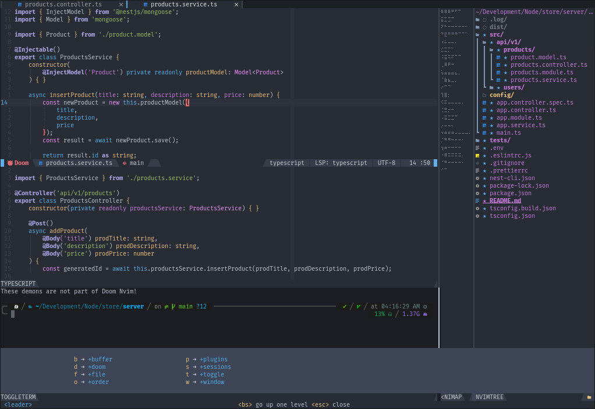

<div align="center">
<!-- ALL-CONTRIBUTORS-BADGE:START - Do not remove or modify this section -->
[](#contributors-)
<!-- ALL-CONTRIBUTORS-BADGE:END -->

# Doom Neovim


[](http://makeapullrequest.com)


[Features](#features) • [Install](#install) • [Documentation] • [Contribute](#contribute)



</div>

---

# Introduction

<a href="http://ultravioletbat.deviantart.com/art/Yay-Evil-111710573">
  
</a>

> It is a story as old as time. A barely new vimmer that is afraid to configure
> Neovim and make it work out-of-the-box without problems, that gets the
> solution to his configuration problems. This is his configuration.

Doom Nvim is a Neovim port of the [doom-emacs](https://github.com/hlissner/doom-emacs) framework.

As a vimmer, I know that it's difficult to configure Vim/Neovim when you are just starting to use it,
how time consuming it's to customize it to your needs and that's why Doom Nvim exists
_also because I love Doom_.

Its goal is to give Neovim an initial configuration to start working in a stable and efficient
development environment without spending a lot of time configuring everything, without forgetting
that we don't all need the same environment.

Its design is guided by these mantras:

- **Gotta go fast.** Startup and run-time performance are priorities.
  That is why Doom Nvim uses Lua instead of Vimscript for its configurations
  and searches for tiny but powerful plugins.
- **Your system, your rules.** You know better than a third party what is
  convenient for you. At least, Doom hopes so! It won't _automatically_
  install system dependencies, plugins that have external dependencies
  (and will force plugins not to do so either if they have any external dependencies).
- **What does not serve you, you throw away.** Doom Nvim is made up of a moderate number
  of plugins (~ 40 plugins as of this writing). You more than anyone know what you need in
  your environment and that's why Doom Nvim allows you to easily disable plugins and add new ones.
  Also, Doom Nvim doesn't come with TreeSitter parsers or LSPs by default,
  so you can use **only** what you need.

# Acknowledgements

- [hlissner](https://github.com/hlissner) per doing Doom Emacs :heart:.
- [romgrk](https://github.com/romgrk) per doing a port to Vim of Doom One
  colorscheme from Doom Emacs (and everyone who improves the colorscheme!).

# Notices

- **2021-05-01**: The `doomrc` is not using Vimscript anymore, please see the
  new [doomrc](./doomrc) file structure for use it with Lua.

# Features

- Minimalistic good looks inspired by modern code editors.
- Curated and sane defaults for many packages.
- A modular organizational structure for separating concerns in your config.
- A declarative and powerful [package management system]
  (powered by `packer.nvim`).
- Opt-in LSP integration for many languages by using the new
  built-in LSP included on Neovim Nightly.
- An Emacs which-key like plugin to manage your `keybindings`, centered around leader
  prefix key (<kbd>SPC</kbd>).
- Per-file indentation style detection and [editorconfig] integration. Let
  someone else argue about tabs vs **_spaces_**.
- Project-management tools.
- Project search (and more) utilities, powered by
  [telescope.nvim].

# Prerequisites

- Curl 7.x
- Git 2.23+
- Neovim Nightly 0.5.0 (for Neovim 0.4.x see the nvim-0.4 branch _coming soon_)
- GNU `find`
- _OPTIONALS:_
  - [ripgrep] 11.0+ or [fd] 7.3.0+ (improves file indexing performance for some commands)
  - `nodejs` and `npm` (required to use the built-in LSP)

Doom is comprised of [~40 optional plugins][modules], some of which may have
additional dependencies. [Please visit their documentation][modules].

# Install

Simply run the following command:

```sh
curl -sLf https://raw.githubusercontent.com/NTBBloodbath/doom-nvim/main/install.sh | bash
```

Then [read our Getting Started guide][getting-started] to be walked through
installing, configuring and maintaining Doom Nvim.

> NOTE: If you want to see all the available commands in the installation script, then use
> <kbd>bash -s -- -h</kbd> instead of just <kbd>bash</kbd>

# Getting help

Neovim is not very difficult. Although you will occasionally run into problems
if you are not an advanced vimmer. When you do, here are some places you can look help:

- [Our documentation][documentation] covers many use cases.
  - [The Configuration section][configuration] covers how to configure Doom Nvim and
    its modules.
  - [The Package Management section][package-management] covers how to install
    and disable modules.
- Search the [Doom Nvim's issue tracker](https://github.com/NTBBloodbath/doom-nvim/issues)
  before opening a new issue to see if your issue was already been reported and to
  avoid duplicating issues.

# Contribute

- I really :heart: pull requests and bug reports (please see the [Contributing Guidelines][contribute] before contributing)!
- Don't hesitate to [tell me my Lua coding style sucks](https://github.com/NTBBloodbath/doom-nvim/issues/new),
  but please tell me why (I am new to Lua, I may have some bad practices that can be fixed in code).

[contribute]: docs/contributing.md
[documentation]: docs/README.md
[getting-started]: docs/getting_started.md
[install]: docs/getting_started.md#install
[configuration]: docs/getting_started.md#configuring-doom
[package-management]: docs/getting_started.md#package-management
[modules]: docs/modules.md
[editorconfig]: http://editorconfig.org/
[fd]: https://github.com/sharkdp/fd
[ripgrep]: https://github.com/BurntSushi/ripgrep
[telescope.nvim]: https://github.com/nvim-telescope/telescope.nvim

## Contributors ✨

Thanks goes to these wonderful people ([emoji key](https://allcontributors.org/docs/en/emoji-key)):

<!-- ALL-CONTRIBUTORS-LIST:START - Do not remove or modify this section -->
<!-- prettier-ignore-start -->
<!-- markdownlint-disable -->
<table>
  <tr>
    <td align="center"><a href="https://github.com/notusknot"><br /><sub><b>notusknot</b></sub></a><br /><a href="https://github.com/NTBBloodbath/doom-nvim/commits?author=notusknot" title="Documentation">📖</a></td>
  </tr>
</table>

<!-- markdownlint-restore -->
<!-- prettier-ignore-end -->

<!-- ALL-CONTRIBUTORS-LIST:END -->

This project follows the [all-contributors](https://github.com/all-contributors/all-contributors) specification. Contributions of any kind welcome!